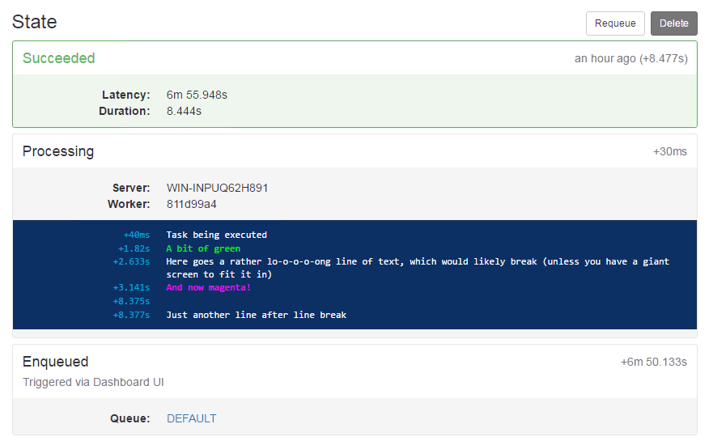

# Hangfire.Console


[](https://www.nuget.org/packages/Hangfire.Console/)

Inspired by AppVeyor, Hangfire.Console provides a console-like logging experience for your jobs. 



## Features

 - **Provider-agnostic**: (allegedly) works with any job storage provider (currently tested with SqlServer and MongoDB). 
 - **100% Safe**: no Hangfire-managed data (e.g. jobs, states) is ever updated, hence there's no risk to corrupt it.
 - **With Live Updates**: new messages will appear as they're logged, as if you're looking at real console.
 - (blah-blah-blah)

## Setup

In .NET Core's Startup.cs:
```c#
public void ConfigureServices(IServiceCollection services)
{
    services.AddHangfire(config =>
    {
        config.UseSqlServerStorage("connectionSting");
        config.UseConsole();
    });
}
```

Otherwise,
```c#
GlobalConfiguration.Configuration
    .UseSqlServerStorage("connectionSting")
    .UseConsole();
```

As usual, you may provide additional options for `UseConsole()` method.

**NOTE**: If you have Dashboard and Server running separately, 
you'll need to call `UseConsole()` on both.

## Log

Hangfire.Console provides extension methods on `PerformContext` object, 
hence you'll need to add it as a job argument. 

Now you can write to console:

```c#
public void TastMethod(PerformContext context)
{
    context.WriteLine("Hello, world!");
}
```

Like with `System.Console`, you can specify text color for your messages:

```c#
public void TastMethod(PerformContext context)
{
    context.SetTextColor(ConsoleTextColor.Red);
    context.WriteLine("Error!");
    context.ResetTextColor();
}
```

Unless specified otherwise, console sessions will expire in 24 hours.